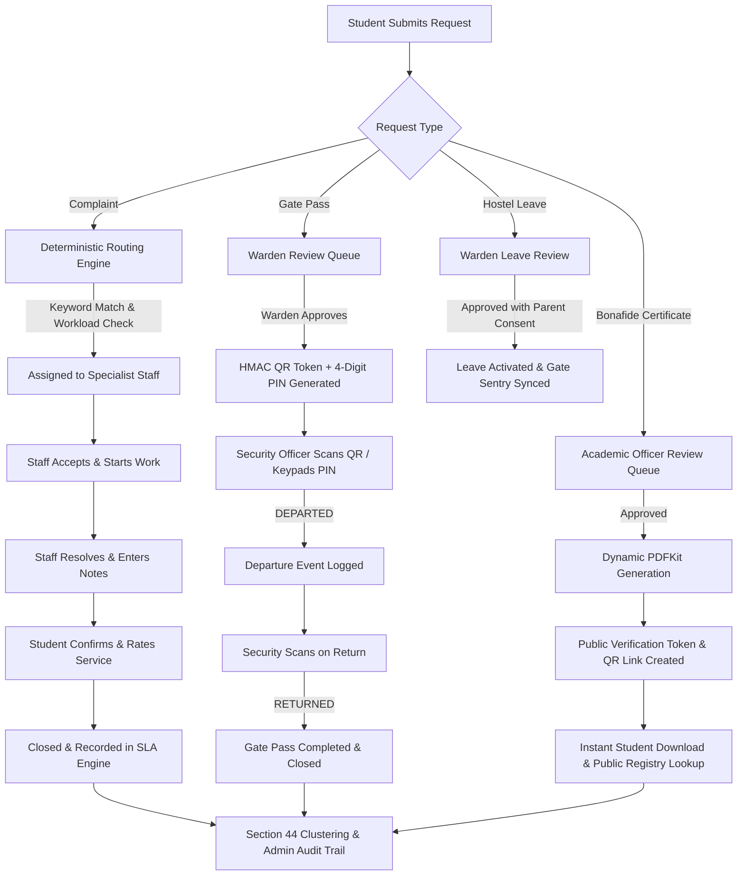
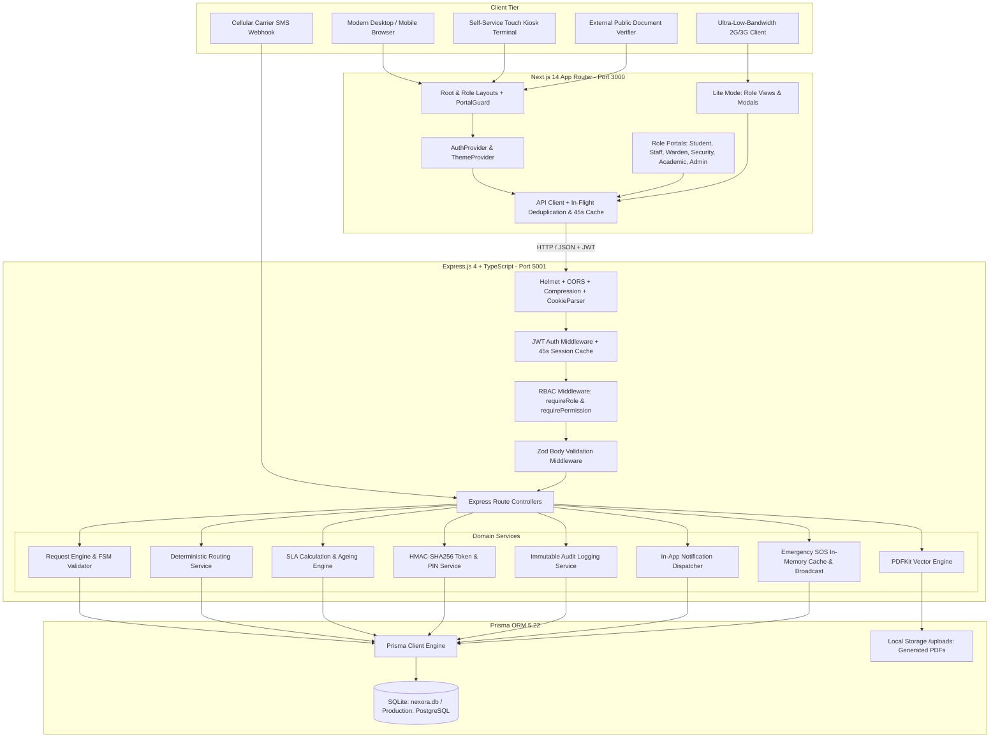
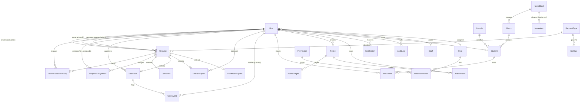
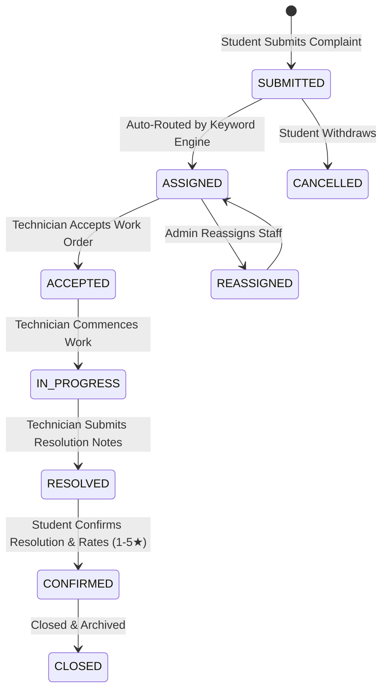
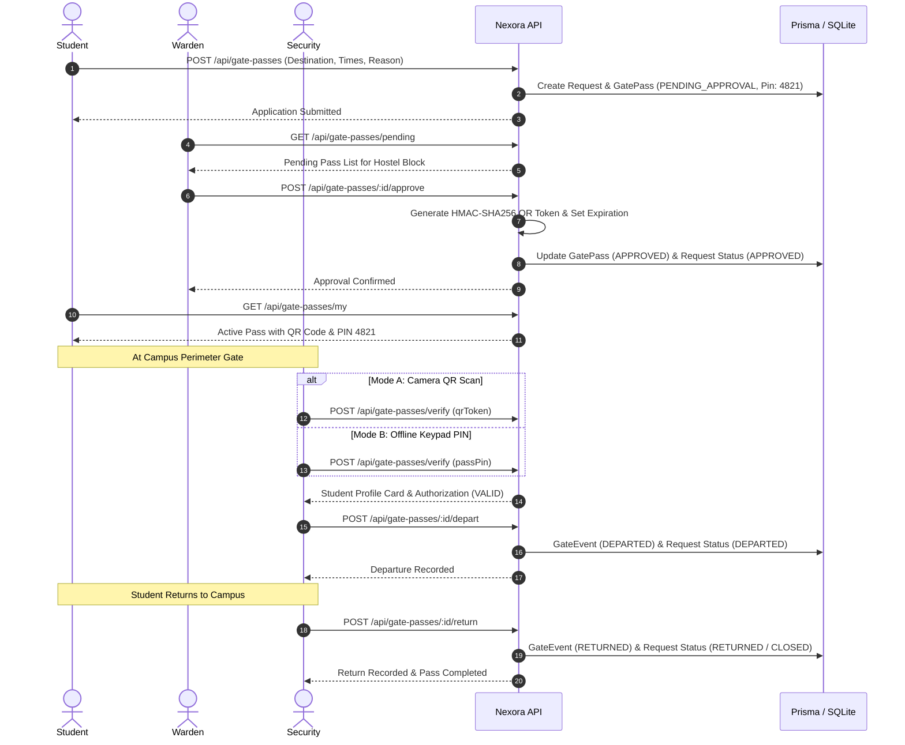
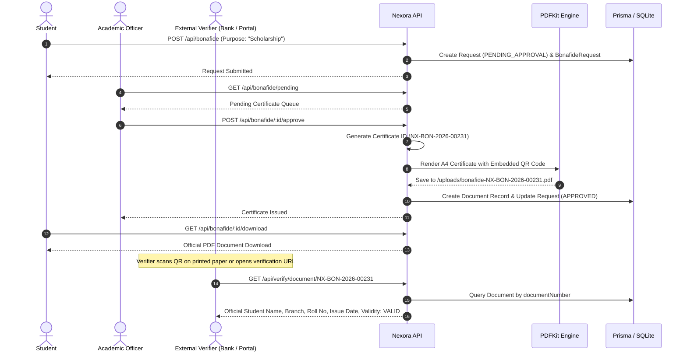

# Nexora Campus

> **One Platform for Every Campus Request**
> A unified digital campus operations and request lifecycle platform engineered to streamline student complaints, deterministic maintenance routing, cryptographically signed gate passes, hostel leaves, dynamic bonafide certificates, targeted announcements, and operational command intelligence.

[](https://github.com/munazirhussan910-cpu/nexora-campus)
[](#7-system-architecture)
[-black?style=flat-square&logo=next.js)](https://nextjs.org)
[](https://nodejs.org)
[-2D3748?style=flat-square&logo=prisma)](https://prisma.io)
[](#13-authentication--security)
[-brightgreen?style=flat-square&logo=jest)](#25-testing)

---

## Table of Contents

1. [Project Title & Executive Summary](#1-project-title)
2. [Overview](#2-overview)
3. [Problem Statement](#3-problem-statement)
4. [Solution & Transformation](#4-solution)
5. [Key Features](#5-key-features)
6. [User Roles & RBAC](#6-user-roles--rbac)
7. [System Architecture](#7-system-architecture)
8. [Technology Stack](#8-technology-stack)
9. [Repository Structure](#9-repository-structure)
10. [Frontend Architecture](#10-frontend-architecture)
11. [Backend Architecture](#11-backend-architecture)
12. [Database Architecture & Entity Relationships](#12-database-architecture)
13. [Authentication & Security](#13-authentication--security)
14. [Core Workflows](#14-core-workflows)
15. [Smart Routing & Automation](#15-smart-routing--automation)
16. [API Documentation](#16-api-documentation)
17. [Environment Variables](#17-environment-variables)
18. [Local Development Setup](#18-local-development-setup)
19. [Running the Project](#19-running-the-project)
20. [Production Deployment](#20-production-deployment)
21. [Performance & Low-Bandwidth Design](#21-performance--low-bandwidth-design)
22. [Accessibility & Campus Inclusivity](#22-accessibility)
23. [Error Handling](#23-error-handling)
24. [Logging & Monitoring](#24-logging--monitoring)
25. [Testing Status](#25-testing)
26. [Git & Development Workflow](#26-git--development-workflow)
27. [Known Limitations](#27-known-limitations)
28. [Roadmap](#28-roadmap)
29. [Future Improvements](#29-future-improvements)
30. [Screenshots & Visual Assets](#30-screenshots--demo)
31. [Demo Credentials](#31-demo-credentials)
32. [Contributors & Team](#32-contributors--team)
33. [License](#33-license)
34. [Final Technical Summary](#34-final-project-summary)

---

## 1. Project Title

**Nexora Campus**  
*Tagline:* **"One Platform for Every Campus Request"**

> A unified digital campus operations and request lifecycle platform for managing student requests, maintenance complaints, automated department routing, hostel leaves, gate security approvals, dynamic bonafide certificates, targeted notices, and administrative workflows.

---

## 2. Overview

### What Problem the Project Solves
Higher education institutions and university campuses run on thousands of daily operational interactions: students reporting malfunctioning electrical switchboards, requesting weekend gate passes, taking emergency leaves, applying for official bonafide certificates, and tracking announcements. 

Traditionally, these interactions are scattered across disconnected physical registers, manual paper chits, phone calls, informal WhatsApp threads, and uncoordinated department desks. Requests are frequently lost, delays are common, accountability is absent, security sentries lack reliable verification mechanisms, and campus administrators remain blind to systemic physical infrastructure decay.

Nexora Campus consolidates all campus operational workflows into a single centralized digital platform governed by a rigorous Finite State Machine (FSM), deterministic zero-latency routing, cryptographic pass verification, and operational intelligence.

### Why the Problem Exists
Universities are complex physical environments with hierarchical, multi-role communities (students, maintenance technicians, hostel wardens, security guards, academic officers, and directors). Generic issue-tracking tools (like Jira or Zendesk) are built for software engineering or enterprise customer service. They fail to represent physical campus constraints:
- Hostel block and room topologies.
- Dual-mode exit authorization (gate curfews, smartphone QR scanning, and offline keypad PIN verification).
- Parent-consent workflows for overnight leaves.
- High-latency, degraded 3G hostel networks requiring ultra-low-bandwidth text interfaces.
- Feature-phone and walk-up students without smartphone access requiring self-service kiosks and SMS gateways.

### Who Uses the System
- **Students**: Raise complaints, track SLA timelines, apply for gate passes/leaves, generate bonafide certificates, review notices, and access an emergency SOS trigger.
- **Staff / Technicians**: Manage assigned maintenance work orders (Plumbing, Electrical, Carpentry, IT, Cleanliness), accept jobs, record technical resolution notes, and receive student performance ratings.
- **Hostel Wardens**: Review and approve gate passes and overnight leaves for their specific hostel blocks, inspect room rosters, monitor unreturned students, and broadcast notices.
- **Main Gate Security Officers**: Verify gate passes at campus perimeter sentries using live camera QR scanning or 4-digit PIN verification, logging exact departure and return timestamps.
- **Academic Officers**: Review student bonafide certificate requests, approve documentation, and dispatch dynamically generated PDFs into the public verification registry.
- **Campus Administrators (Command Center)**: Access campus-wide operational metrics, SLA compliance rates, ageing distributions, staff workload queues, Section 44 clustered infrastructure failure detection, and immutable audit logs.

### What Makes Nexora Campus Different
1. **Deterministic Zero-Latency Routing**: Instead of non-deterministic, high-latency, and costly external LLM API calls, ticket routing is governed by a fast keyword-scoring algorithm (< 1ms execution) backed by active database routing rules.
2. **Dual-Mode Cryptographic Gate Security**: Every approved gate pass issues an HMAC-SHA256 cryptographically signed QR code alongside a synchronized 4-digit numeric fallback PIN, preventing sentry bottlenecks when students experience dead phone batteries or network dropouts.
3. **Multi-Role Low-Bandwidth Mode (`/lite`)**: A dedicated, ultra-low-bandwidth portal mode (`?lite=true`) providing specialized text-driven views for all six user roles, eliminating heavy asset downloads and reducing payloads for weak 2G/3G hostel networks.
4. **Section 44 Clustered Issue Detection**: Automatically identifies systemic infrastructure failure by clustering complaints over rolling 14-day windows (e.g., detecting multiple plumbing leaks across Block B as an overarching pipeline failure rather than isolated tenant complaints).
5. **Public Anti-Counterfeit Document Registry**: Generates vector-rendered A4 Bonafide Certificates via PDFKit stamped with individual verification tokens and QR links, allowing external banks, scholarship boards, and employers to verify authenticity without logging in.

---

## 3. Problem Statement

| Problem Area | Current University Reality | Impact on Campus Operations |
|---|---|---|
| **Maintenance & Complaints** | Paper logbooks at hostel security desks; verbal communication with technicians; no progress tracking. | Tickets forgotten for weeks; duplicate entries; no technician accountability; student frustration. |
| **Gate Passes & Security** | Handwritten paper slips signed by wardens; easily forged; easily damaged; sentries lack live student photos. | Unauthorized campus departures; curfew tracking failure; long queues at gatehouse; vulnerability to student impersonation. |
| **Hostel Leave Approvals** | Students fill physical forms, collect manual signatures from wardens, and submit paper slips at gates. | Time-consuming physical bureaucracy; impossible to verify parent consent; records lost after departure. |
| **Academic Certificates** | Multiple visits to academic administrative cell; days of delay for a printed bonafide certificate. | Delays in passport and scholarship deadlines; forged certificates submitted to external organizations. |
| **Infrastructure Insights** | Maintenance treats each repair in isolation without tracking historical failure patterns. | Continuous reactive repairs (e.g. patching single taps) while structural issues (corroded main pipelines) go unnoticed. |
| **Network & Device Inequity** | Heavy SPAs fail on congested 3G hostel Wi-Fi; students with basic phones cannot participate. | Unequal access to basic campus services for non-smartphone users or students in poor coverage blocks. |

---

## 4. Solution

Nexora Campus replaces fragmented manual touchpoints with a unified, state-governed digital pipeline:



---

## 5. Key Features

### Student Features
- **Centralized Dashboard**: Live status badges, real-time SLA countdown clocks, and chronological activity timelines for all submitted campus interactions.
- **Maintenance Complaint Submission**: Categorized under Plumbing, Electrical, Carpentry, Network, and Cleanliness with optional photo attachment URL and location specifier.
- **Service Rating & Closure**: Two-tier closure model where students confirm work completion, award 1–5 star ratings, and submit feedback comments before tickets close.
- **Gate Pass Generator**: Request day or weekend campus leave; receive live status updates, an HMAC-signed dynamic QR code, and a 4-digit fallback PIN upon warden approval.
- **Overnight Hostel Leave**: Submit multi-day leave requests specifying emergency guardian contact details and parent consent declaration.
- **Instant Bonafide Certificate**: Select request purpose (Scholarship, Bank Account, Internship, Higher Education), trigger review, and download official signed PDFs instantly upon approval.
- **Targeted Notice Board**: Clean feed of administrative notices automatically scoped to the student's branch, academic year, and hostel block.
- **Emergency SOS Broadcast**: Immediate single-tap distress trigger notifying security sentries and hostel wardens with student location, room number, and phone.

### Staff / Maintenance Features
- **Active Work Queue**: Filtered list of assigned work orders prioritized by urgency (LOW, NORMAL, HIGH, URGENT) and SLA status.
- **Action State Transitions**: Single-click actions to transition tickets from `ASSIGNED` &rarr; `ACCEPTED` &rarr; `IN_PROGRESS` &rarr; `RESOLVED`.
- **Resolution Documentation**: Form to submit repair notes detailing materials replaced, work performed, and preventive steps taken.
- **Performance & History Review**: Access completed work orders, historical average resolution times, and student ratings.

### Warden Features
- **Hostel Command Dashboard**: Metrics scoped to the warden's assigned residential block (e.g., Block B), displaying active resident counts, open repairs, pending leaves, and active gate passes.
- **Gate Pass Review Hub**: Single-pane review of student exit requests with one-click approval (auto-generating credentials) or rejection with mandatory feedback.
- **Hostel Leave Approvals**: Verify emergency contact information, validate parent consent flags, and approve overnight leaves.
- **Student Roster & Room Allocations**: Complete list of hostel residents searchable by roll number, room number, and branch.
- **Targeted Notice Broadcasting**: Issue official block notices pushed directly to residents' dashboards.

### Security Sentry Features
- **Sentry Command Console**: Live monitor of campus perimeter activity, departed students, and overdue curfews.
- **Dual Verification Scanner**: Integrated camera barcode scanner for real-time HMAC QR decoding, backed by an immediate 4-digit PIN keypad entry.
- **Instant Resident Profile Card**: Scanning displays verified student photo placeholder, full name, roll number, hostel block, room number, emergency phone, and destination.
- **One-Click Gate Logging**: Log physical departures (`DEPARTED`) and entries (`RETURNED`) with sub-second timestamp auditing.

### Academic Officer Features
- **Academic Approvals Hub**: Dedicated dashboard for certificate operations, displaying pending applications, approved registries, and rejection records.
- **Official Bonafide Issuance**: Validate student credentials and trigger server-side vector PDF generation stamping official signatures and verification tokens.
- **Application Rejection**: Reject invalid requests with recorded reasons dispatched to the student's notification drawer.

### Admin Features (Command Center)
- **Operational Cockpit**: Real-time high-level telemetry tracking Total Requests, Active Open Tickets, Overdue Breaches, Pending Approvals, Today's Resolutions, and Active Technicians.
- **Section 44 Clustered Issue Detection**: Autonomous intelligence aggregating complaints within rolling 14-day windows to detect recurring physical infrastructure failures (&ge; 3 complaints in the same block and category).
- **SLA Deep-Dive & Ageing Breakdown**: Detailed analysis categorized by age brackets (`< 12h`, `12–24h`, `24–48h`, `> 48h`) alongside campus compliance rates.
- **Workforce & Staff Directory**: Monitor active task loads across electricians, plumbers, carpenters, and wardens to identify assignment bottlenecks.
- **Campus Roster Management**: Inspect student profiles, roll numbers, hostel room mapping, and department distribution.
- **Immutable Audit Trail**: Chronological log of all campus state mutations capturing actor ID, action code, target entity, JSON snapshots of previous vs. new values, IP address, and browser user agent.

### Specialized Interfaces
- **Lite / Low-Bandwidth Mode (`/lite`)**: Dedicated lightweight portal eliminating heavy asset waterfalls, utilizing optimized database projections (`?lite=true`) and dedicated views for all 6 user roles.
- **Self-Service Kiosk Mode (`/kiosk`)**: Walk-up terminal interface optimized for touchscreen hardware; allows roll-number identification and direct ticket creation without requiring a mobile device.
- **Inbound SMS Gateway (`/api/integrations/sms/inbound`)**: Webhook endpoint accepting structured SMS text payloads (e.g., `TICKET B204 TAP LEAKING` or `GATEPASS MARKET`) for non-smartphone users.
- **Public Verification Portal (`/verify/[certificateId]`)**: Public-facing route allowing external verifying agencies to inspect certificate legitimacy, student enrollment details, and issue validity without authentication.

---

## 6. User Roles & RBAC

Nexora Campus enforces granular Role-Based Access Control (RBAC) across 6 distinct personas and 24 system permissions:

| Role | Primary Scope | Typical Responsibilities | Accessible Routes | Authentication & Guard |
|---|---|---|---|---|
| **STUDENT** | Student Services | Raise complaints, request passes/leaves/bonafides, view notices, trigger SOS. | `/student/*`, `/lite` | JWT Cookie / Bearer &rarr; `PortalGuard` |
| **STAFF** | Facility Operations | Accept assigned repair orders, record notes, resolve maintenance tickets. | `/staff/*`, `/lite` | JWT Cookie / Bearer &rarr; `PortalGuard` |
| **WARDEN** | Residential Life | Approve gate passes and leaves for assigned hostel block, oversee residents. | `/warden/*`, `/lite` | JWT Cookie / Bearer &rarr; `PortalGuard` |
| **SECURITY** | Campus Perimeter | Scan QR/PIN gate passes, log departure/arrival timestamps, monitor curfews. | `/security/*`, `/lite` | JWT Cookie / Bearer &rarr; `PortalGuard` |
| **ACADEMIC_OFFICER** | Academic Cell | Review and approve bonafide certificate requests, issue certified documents. | `/academic/*`, `/lite` | JWT Cookie / Bearer &rarr; `PortalGuard` |
| **ADMIN** | Executive Operations | Campus-wide oversight, Section 44 analytics, SLA monitoring, audit inspection. | `/admin/*`, `/lite` | JWT Cookie / Bearer &rarr; `PortalGuard` |

### Role Permissions Matrix

| Permission Code | Description | STUDENT | STAFF | WARDEN | SECURITY | ACADEMIC | ADMIN |
|---|---|:---:|:---:|:---:|:---:|:---:|:---:|
| `requests.create` | Create any campus request | &check; | | | | | &check; |
| `requests.view.own` | View user's own requests | &check; | &check; | | | | &check; |
| `requests.view.all` | View all campus requests | | | &check; | | | &check; |
| `requests.assign` | Assign request to technician | | | | | | &check; |
| `requests.reassign` | Reassign tickets between staff | | | | | | &check; |
| `requests.resolve` | Mark maintenance ticket resolved | | &check; | | | | &check; |
| `gatepass.create` | Apply for exit gate pass | &check; | | | | | &check; |
| `gatepass.approve` | Approve exit gate pass | | | &check; | | | &check; |
| `gatepass.reject` | Reject exit gate pass | | | &check; | | | &check; |
| `gatepass.verify` | Verify QR/PIN at gatehouse | | | | &check; | | &check; |
| `leave.create` | Submit hostel leave application | &check; | | | | | &check; |
| `leave.approve` | Approve hostel leave request | | | &check; | | | &check; |
| `leave.reject` | Reject hostel leave request | | | &check; | | | &check; |
| `bonafide.create` | Request bonafide certificate | &check; | | | | | &check; |
| `bonafide.approve` | Approve & issue bonafide PDF | | | | | &check; | &check; |
| `bonafide.reject` | Reject bonafide certificate request | | | | | &check; | &check; |
| `academic.dashboard` | View Academic Officer console | | | | | &check; | &check; |
| `notices.view` | View targeted announcements | &check; | &check; | &check; | &check; | &check; | &check; |
| `notices.create` | Publish targeted announcements | | | &check; | | | &check; |
| `analytics.view` | View command center analytics | | | | | | &check; |
| `audit.view` | Inspect immutable audit logs | | | | | | &check; |
| `staff.manage` | Manage campus staff directory | | | | | | &check; |
| `students.manage` | Manage student allocations | | | &check; | | | &check; |
| `configuration.manage` | Manage rules and SLAs | | | | | | &check; |

---

## 7. System Architecture

Nexora Campus is architected as a clean, highly cohesive **Modular Monolith**. It separates concerns between client presentation, an API gateway and middleware pipeline, a domain-driven business logic layer, and a relational data tier.



---

## 8. Technology Stack

| Technology | Version | Purpose | Where Used |
|---|---|---|---|
| **Next.js** | `^14.2.20` | Full-stack React framework with App Router, server-rendered components, and routing | Frontend root (`frontend/app`) |
| **React** | `^18.3.1` | Declarative UI rendering, interactive state management, and hooks | Frontend views, modals, widgets |
| **TypeScript** | `^5.7.2` | Static typing, interface contracts, compile-time safety across full stack | Both Frontend and Backend |
| **Tailwind CSS** | `^3.4.16` | Utility-first styling, responsive grids, dark-academic / slate theme design tokens | Entire frontend design system |
| **Lucide React** | `^0.468.0` | Production-grade SVG icons for dashboards, navigation, and state indicators | Frontend components and layouts |
| **qrcode.react** | `^4.2.0` | Client-side QR code rendering for Gate Pass display and ticket badges | Student portal, gate pass views |
| **clsx & tailwind-merge** | `^2.1.1` / `^2.5.5` | Conditional class manipulation and conflict-free Tailwind merging | Frontend layout utilities (`lib/utils`) |
| **Node.js** | `v18+` / `v20+` | Server runtime environment executing backend services | Backend application runtime |
| **Express.js** | `^4.21.2` | RESTful API server, routing controllers, and middleware pipeline | Backend application (`src/app.ts`) |
| **Prisma ORM** | `^5.22.0` | Type-safe database client, schema migrations, and relation querying | Backend data access (`prisma/schema.prisma`) |
| **SQLite** | `v3` | Zero-configuration relational database for local development and testing | Local storage (`prisma/nexora.db`) |
| **jsonwebtoken** | `^9.0.2` | Signed stateless token authentication and payload encoding | Auth routes & auth middleware |
| **bcryptjs** | `^2.4.3` | Cryptographic password hashing (10 salt rounds) | User registration & authentication |
| **cookie-parser** | `^1.4.7` | HTTP-only cookie parsing for secure browser session handling | Backend middleware |
| **helmet** | `^8.0.0` | Security headers (CSP, HSTS, cross-origin resource policies) | Backend API server entrypoint |
| **cors** | `^2.8.5` | Cross-Origin Resource Sharing with whitelisted frontend origins and credentials | Backend API server entrypoint |
| **compression** | `^1.8.2` | Gzip/deflate response compression for high-performance data transfer | Backend API server entrypoint |
| **zod** | `^3.24.1` | Runtime schema validation for request payloads and input sanitation | Route input validation middleware |
| **pdfkit** | `^0.16.0` | Vector-rendered official academic PDF generation | Bonafide certificate service |
| **qrcode** | `^1.5.4` | Server-side QR buffer generation embedded into generated PDFs | Bonafide PDF service & verification |
| **crypto** | Built-in | HMAC-SHA256 token generation and verification hashes | Gate Pass security service |
| **Jest & Supertest** | `^29.7.0` / `^7.0.0` | Unit & end-to-end integration testing for API endpoints and FSM logic | Test suite (`src/tests`) |
| **concurrently** | `^9.2.4` | Multi-process monorepo orchestrator running frontend & backend concurrently | Root workspace script (`npm run dev`) |

---

## 9. Repository Structure

```text
Nexora/
├── backend/
│   ├── dist/                      # Compiled JavaScript output (tsc)
│   ├── prisma/
│   │   ├── migrations/            # Version-controlled SQL migration history
│   │   ├── nexora.db              # Local zero-setup SQLite database file
│   │   ├── schema.prisma          # Database models, relations & indexes (28 models)
│   │   └── seed.ts                # Master seed script (roles, personas, rules, clusters)
│   ├── src/
│   │   ├── config/
│   │   │   ├── env.ts             # Centralized environment variable loader & defaults
│   │   │   └── prisma.ts          # Singleton PrismaClient instance
│   │   ├── middleware/
│   │   │   ├── auth.middleware.ts # JWT verification & 45-second fast session cache
│   │   │   ├── error.middleware.ts# Centralized AppError handling & HTTP response formatter
│   │   │   ├── rateLimit.middleware.ts # IP-based sliding window rate limiter
│   │   │   ├── rbac.middleware.ts # requireRole & requirePermission route guards
│   │   │   └── validate.middleware.ts # Zod schema validation middleware
│   │   ├── routes/
│   │   │   ├── academic.routes.ts # Academic Officer dashboard & approval queues
│   │   │   ├── admin.routes.ts    # Command Center, SLA ageing, Section 44, staff & audits
│   │   │   ├── auth.routes.ts     # Login, student self-registration, session & personas
│   │   │   ├── bonafide.routes.ts # Bonafide requests, approval, PDF rendering & downloads
│   │   │   ├── complaint.routes.ts# Complaint creation, routing, accept/start/resolve & ratings
│   │   │   ├── emergency.routes.ts# Real-time SOS triggers, sentry acknowledgment & resolution
│   │   │   ├── gatepass.routes.ts # Gate pass applications, warden review & security verify
│   │   │   ├── integration.routes.ts # Inbound SMS text webhook gateway
│   │   │   ├── kiosk.routes.ts    # Touch kiosk student lookup & walk-up request creation
│   │   │   ├── leave.routes.ts    # Hostel overnight leave creation, approval & rejection
│   │   │   ├── notice.routes.ts   # Targeted announcement publishing & audience filtering
│   │   │   ├── notification.routes.ts # In-app notification polling & read state updates
│   │   │   ├── request.routes.ts  # Master Request Engine, timelines, status & reassignment
│   │   │   └── verify.routes.ts   # Unauthenticated public certificate validation endpoint
│   │   ├── services/
│   │   │   ├── audit.service.ts   # Immutable audit log recording with transactional support
│   │   │   ├── emergency.service.ts # High-speed in-memory SOS caching & database persistence
│   │   │   ├── notification.service.ts # In-app notification creation utility
│   │   │   ├── pdf.service.ts     # A4 vector PDF document synthesis with QR stamping
│   │   │   ├── qr.service.ts      # HMAC-SHA256 QR token & 4-digit PIN generation
│   │   │   ├── request.service.ts # Request state machine (FSM), transitions & assignments
│   │   │   ├── routing.service.ts # Deterministic keyword-scoring category & staff router
│   │   │   └── sla.service.ts     # SLA due dates, countdowns, breach checks & ageing metrics
│   │   ├── tests/
│   │   │   ├── auth.test.ts       # Full authentication, RBAC and session test suite
│   │   │   └── nexora.test.ts     # Master integration test suite (24 passing tests)
│   │   ├── types/
│   │   │   └── auth.ts            # AuthenticatedRequest and User token payload types
│   │   ├── app.ts                 # Express application configuration & route binding
│   │   └── server.ts              # HTTP server listener & graceful shutdown handlers
│   ├── uploads/                   # Generated bonafide PDFs and static document files
│   ├── .env.example               # Backend local environment template
│   ├── .env.production.example    # Backend production deployment template
│   ├── jest.config.js             # Jest test runner configuration
│   ├── package.json               # Backend dependencies & scripts
│   └── tsconfig.json              # Backend TypeScript compiler configuration
├── frontend/
│   ├── app/
│   │   ├── academic/              # Academic Officer Portal (Dashboard, Approvals, Profile)
│   │   ├── admin/                 # Admin Command Center (Cockpit, SLA, Section 44, Audit, Staff)
│   │   ├── kiosk/                 # Self-Service Walk-Up Touch Terminal
│   │   ├── lite/                  # Multi-Role Ultra-Low-Bandwidth Portal & Modals
│   │   ├── login/                 # Central Authentication Portal with role guidance
│   │   ├── register/              # Student Self-Registration Portal
│   │   ├── security/              # Security Sentry Portal (QR/PIN Scanner, Activity Log)
│   │   ├── staff/                 # Maintenance Technician Portal (Work Orders, History, SLA)
│   │   ├── student/               # Student Portal (Dashboard, Complaints, Passes, Leaves, Docs)
│   │   ├── verify/[certificateId]/# Public Document Verification Page
│   │   ├── globals.css            # Tailwind directives, theme variables & animations
│   │   ├── layout.tsx             # Root layout with ThemeProvider, AuthProvider & PersonaSwitcher
│   │   └── page.tsx               # High-impact product landing page with interactive demos
│   ├── components/
│   │   ├── analytics/             # Operational analytics charts and visual graphs
│   │   ├── cards/                 # StatCard and metric summaries
│   │   ├── emergency/             # StudentSosModal & SecuritySosBanner components
│   │   ├── layout/                # Navbar, Sidebar, PortalGuard, PersonaSwitcher, ThemeToggle
│   │   ├── status/                # StatusBadge, PriorityBadge, SLAIndicator components
│   │   ├── tables/                # Chronological Timeline and request audit tables
│   │   └── ui/                    # Accordion, EmptyState, SkeletonLoader components
│   ├── lib/
│   │   ├── api.ts                 # Type-safe API client with request deduplication & 45s cache
│   │   ├── auth-context.tsx       # React authentication context & active user state
│   │   └── theme-context.tsx      # Dark / Light theme context provider
│   ├── public/                    # Static brand logos, favicons and SVG vectors
│   ├── .env.example               # Frontend environment template
│   ├── next.config.mjs            # Next.js configuration
│   ├── package.json               # Frontend dependencies & scripts
│   ├── tailwind.config.ts         # Tailwind theme customization and color tokens
│   └── tsconfig.json              # Frontend TypeScript configuration
├── docs/                          # Comprehensive technical documentation
│   ├── screenshots/               # High-resolution screenshots of key user journeys
│   ├── API.md                     # REST API reference guide
│   ├── ARCHITECTURE.md            # System design and FSM specifications
│   ├── DATABASE.md                # Prisma schema definitions and data dictionary
│   ├── DEMO.md                    # 3-minute hackathon evaluation script
│   ├── DEPLOYMENT.md              # Cloud deployment and containerization guide
│   ├── Note.md                    # In-depth architectural analysis and judge Q&A guide
│   └── ONBOARDING_GUIDE.md        # Comprehensive technical onboarding guide
├── .gitignore                     # Git exclusion rules
├── CONTRIBUTING.md                # Contributor guide and branching policies
├── Logo.png                       # High-resolution Nexora Campus logo asset
├── package.json                   # Root monorepo workspace orchestrator
├── render.yaml                    # Infrastructure-as-code deployment blueprint for Render
└── README.md                      # Primary project documentation (this document)
```

---

## 10. Frontend Architecture

The frontend is built on **Next.js 14** utilizing the modern **App Router** paradigm with React 18, TypeScript, and Tailwind CSS.

### Architecture Highlights
1. **Role-Driven Route Groups**: Each campus persona has a strictly scoped route tree (`/student`, `/staff`, `/warden`, `/security`, `/academic`, `/admin`).
2. **Client-Side Security (`PortalGuard`)**: Custom higher-order layout component that intercepts unauthorized access. If an authenticated user's role does not match the route directory's required role, `PortalGuard` redirects them to their appropriate dashboard automatically.
3. **Session & Auth State (`AuthProvider`)**: Wraps the application tree, maintaining user profile data, active role, permissions list, and session status via `useAuth()`. Exposes methods for login, registration, logout, and instant demo persona switching.
4. **Resilient Network Client (`api.ts`)**:
   - **In-Flight Request Deduplication**: Pools concurrent identical `GET` promises into a single active HTTP request, preventing network waterfalls.
   - **Client-Side Memory Cache**: Caches `GET` responses for 45 seconds partitioned by user token to guarantee zero cross-user cache contamination.
   - **Automatic Cache Invalidation**: Automatically purges relevant cache keys upon `POST`, `PATCH`, `PUT`, or `DELETE` mutations.
5. **Theme Management (`ThemeProvider`)**: Custom theme provider managing persistent dark/light mode toggles using CSS variables and HTML data attributes.
6. **Development Persona Switcher**: A floating widget enabled in development (`PersonaSwitcher.tsx`) allowing judges and developers to hot-switch between all 6 campus personas with one click without manually typing credentials.
7. **Ultra-Low Bandwidth Architecture (`/lite`)**: A self-contained Next.js page that bypasses complex UI layout trees and renders direct table views for all 6 roles with instant client-side tab switching.

---

## 11. Backend Architecture

The backend is built as a robust Express 4 application using strict TypeScript typings, modular route controllers, and clean service abstractions.

### Request Pipeline

```text
Incoming HTTP Request
  │
  ├──► [1. Helmet] (Sets HTTP security headers, CORS origin protection)
  ├──► [2. Compression] (Gzip/deflate compression for JSON and static responses)
  ├──► [3. CORS Middleware] (Validates Origin against allowed frontend domains)
  ├──► [4. Body & Cookie Parsers] (express.json, express.urlencoded, cookieParser)
  ├──► [5. Static File Server] (Serves /uploads for generated PDFs)
  ├──► [6. Authentication Middleware] (Decodes JWT, verifies signature, checks 45s cache)
  ├──► [7. RBAC Middleware] (requireRole / requirePermission checks)
  ├──► [8. Validation Middleware] (Zod schema validation on req.body)
  ├──► [9. Route Controller] (Extracts parameters, calls domain services)
  │      │
  │      └──► [Domain Services: RequestService, RoutingService, QrService, etc.]
  │             │
  │             └──► [Prisma Client / Transactions] ──► Database
  │
  └──► [10. Error Handler Middleware] (Catches AppError or unhandled exceptions, returns standard JSON)
```

### Core Service Responsibilities
- **`RequestService`**: The core operational engine. Generates unique human-readable ticket identifiers (e.g., `NX-10291`), enforces the legal status transition matrix, executes multi-model database transactions, records immutable status histories, and dispatches in-app notifications.
- **`RoutingService`**: Evaluates complaint titles and descriptions against active database keyword rules to classify the department and target specialization, subsequently binding the ticket to an active technician.
- **`SlaService`**: Computes dynamic resolution deadlines based on request type, priority level, and category. Evaluates whether open tickets are `ON_TRACK`, `AT_RISK` (&le; 4 hours remaining), or `BREACHED`.
- **`QrService`**: Synthesizes HMAC-SHA256 signatures over gate pass metadata and generates a random 4-digit fallback PIN. Produces base64 Data URL QR images for immediate client display.
- **`PdfService`**: Directly streams vector-drawn A4 Bonafide Certificates using PDFKit, complete with official university crest styling, formal legal certification text, dynamic issue dates, authorized signatory blocks, and a scannable verification QR code.
- **`AuditService`**: Records every significant system mutation into an immutable `AuditLog` table with actor reference, action code, target entity, JSON snapshots of state changes, IP address, and user agent.
- **`NotificationService`**: Publishes targeted alerts (INFO, SUCCESS, WARNING, ALERT) to user notification drawers.
- **`EmergencyService`**: In-memory cache coupled with database persistence managing live SOS distress alerts broadcast to security and warden desks.

---

## 12. Database Architecture

The data tier is managed through **Prisma ORM** with 28 structured models. While configured for local **SQLite** (`nexora.db`) for zero-setup local execution, the schema is 100% compatible with **PostgreSQL** for enterprise deployment.

### Entity Relationship Diagram



### Core Schema Models Summary

| Model Name | Core Attributes | Relationships & Indices |
|---|---|---|
| **`User`** | `id`, `username`, `email`, `passwordHash`, `roleId`, `isActive`, `lastLoginAt` | FK &rarr; `Role`. Relations to Student, Staff, Requests, Approvals, Notices, Audits. Indexed on `roleId`, `email`, `username`. |
| **`Role`** & **`Permission`** | `Role.name` (`STUDENT`, `STAFF`, `WARDEN`, `SECURITY`, `ADMIN`, `ACADEMIC_OFFICER`), `Permission.code` | Linked via `RolePermission` with compound unique index `@@unique([roleId, permissionId])`. |
| **`Student`** | `rollNumber`, `fullName`, `year`, `phone`, `parentPhone`, `admissionYear` | FK &rarr; `User`, `Branch`, `Room`. Indexed on `rollNumber`, `branchId`, `hostelRoomId`. |
| **`Staff`** | `employeeId`, `fullName`, `department`, `designation`, `specialization`, `phone` | FK &rarr; `User`. Indexed on `employeeId`, `department`, `specialization`. |
| **`HostelBlock`** & **`Room`** | `HostelBlock.name` (`Block A`–`D`), `gender`, `wardenName`; `Room.roomNumber`, `floor`, `capacity` | Compound unique index `@@unique([hostelBlockId, roomNumber])`. |
| **`Request`** | `requestNumber` (`NX-10291`), `status`, `priority`, `title`, `description`, `location`, `dueAt`, `completedAt` | Central entity. FKs &rarr; `User` (requester, assignedStaff, approver, rejecter), `RequestType`. Indexed on `status`, `priority`, `assignedTo`, `requesterId`, `dueAt`. |
| **`RequestStatusHistory`**| `oldStatus`, `newStatus`, `comment`, `createdAt` | FK &rarr; `Request`, `User`. Immutable audit record of state changes. |
| **`Complaint`** | `category`, `subCategory`, `issueType`, `photoUrl`, `resolutionNotes`, `studentRating`, `studentFeedback` | 1-to-1 extension of `Request`. Indexed on `category`. |
| **`GatePass`** | `destination`, `reason`, `departureTime`, `expectedReturnTime`, `passPin`, `qrTokenHash`, `qrExpiresAt`, `gateStatus` | 1-to-1 extension of `Request`. Indexed on `gateStatus`, `qrTokenHash`, `passPin`. |
| **`GateEvent`** | `eventType` (`DEPARTED`, `RETURNED`, `VERIFIED`), `eventTime`, `verificationMethod` (`QR`, `PIN`), `notes` | FK &rarr; `GatePass`, `User` (security verifier). Indexed on `gatePassId`, `eventTime`. |
| **`LeaveRequest`** | `startDate`, `endDate`, `reason`, `emergencyContact`, `parentConsent`, `status` | 1-to-1 extension of `Request`. Indexed on `status`. |
| **`BonafideRequest`** | `purpose`, `certificateId` (`NX-BON-2026-XXXXX`), `generatedAt`, `documentUrl`, `verificationToken` | 1-to-1 extension of `Request`. Indexed on `certificateId`. |
| **`Document`** | `documentType`, `documentNumber`, `fileUrl`, `verificationToken`, `issuedAt`, `expiresAt`, `status` | Official public document verification registry. Indexed on `documentNumber`, `verificationToken`. |
| **`Notice`** & **`NoticeTarget`** | `title`, `content`, `priority`, `publishedAt`, `status`; `targetType` (`ALL`, `BRANCH`, `YEAR`, `HOSTEL`), `targetValue` | Targeted broadcasts with audience filtering. Scoped down to SQLite index level. |
| **`IssueAlert`** | `hostelBlockId`, `category`, `complaintCount`, `windowDays` (14), `status` (`ACTIVE`, `RESOLVED`) | Section 44 systemic infrastructure cluster tracking. Indexed on `hostelBlockId`, `status`. |
| **`AuditLog`** | `actorId`, `action`, `entityType`, `entityId`, `oldValues` (JSON), `newValues` (JSON), `ipAddress`, `userAgent` | Comprehensive audit trail. Indexed on `actorId`, `action`, `entityType`, `createdAt`. |

---

## 13. Authentication & Security

Security in Nexora Campus is designed around defensible, industry-standard practices:

### 1. Authentication & Token Management
- **Stateless JSON Web Tokens (JWT)**: Signed with HMAC-SHA256 (`JWT_SECRET`) containing user ID, role name, email, and username with a 7-day expiration lifespan.
- **Dual Token Transmission**: Supports both HTTP-only browser session cookies (`token`) and the standard `Authorization: Bearer <token>` header for mobile and API clients.
- **Password Security**: Passwords are hashed using `bcryptjs` with 10 salt rounds. Plaintext passwords are never logged or stored.
- **Registration Policy**: Self-registration (`POST /api/auth/register`) is strictly restricted to `STUDENT` accounts. Privileged accounts (Staff, Warden, Security, Academic, Admin) must be provisioned administratively.

### 2. Fast Session Cache
To protect the backend from query waterfalls when students on congested 3G networks load dashboards, `auth.middleware.ts` maintains a short-lived **45-second in-memory session cache**. Validated JWT tokens cache the user's role and permission tree in memory, reducing redundant database lookups while remaining ephemeral.

### 3. Cryptographic Gate Pass Security
- **HMAC-SHA256 Signature**: Gate pass QR codes contain an HMAC signature generated from the pass ID, student roll number, and expiration timestamp:
  ```typescript
  const signature = crypto.createHmac('sha256', config.jwtSecret)
    .update(`${gatePassId}:${rollNumber}:${expiresAt.getTime()}`)
    .digest('hex').slice(0, 16);
  ```
- **Fallback Verification PIN**: A pseudo-random 4-digit PIN is synchronized with the gate pass record. If a student's phone battery dies or the screen is cracked, sentries can authenticate the pass by entering the PIN.
- **Anti-Replay Protection**: The `GatePass` state machine prevents duplicate departures. Once marked `DEPARTED`, the pass can only be used for `RETURNED`. Once returned, the pass is permanently closed.

### 4. Input Validation & Defense-in-Depth
- **Strict Zod Schemas**: Every incoming mutating request payload is validated against strict Zod definitions before reaching controller logic, stripping extraneous properties and rejecting malformed types.
- **HTTP Security Headers**: `helmet` enforces cross-origin resource policies, content-security headers, and frameguard protections.
- **CORS Hardening**: Strict origin whitelisting configured for the frontend host with credentials support.
- **Immutable Audit Trail**: High-impact administrative actions (ticket status updates, pass approvals, document issuance, user reassignment) log pre- and post-mutation JSON diffs alongside network metadata.

---

## 14. Core Workflows

### 1. Maintenance Complaint Lifecycle



### 2. Dual-Mode Gate Pass Lifecycle



### 3. Bonafide Certificate & Public Verification



---

## 15. Smart Routing & Automation

Nexora Campus features an autonomous **Deterministic Keyword Routing Engine** (`RoutingService`) designed specifically to avoid the latency, non-deterministic drift, operational costs, and offline vulnerabilities of external AI APIs.

### Routing Logic
1. **Payload Ingestion**: Concatenates complaint title and problem description into a normalized lowercase text string.
2. **Rule Retrieval**: Fetches all active routing rules from the database (`RoutingRule` table).
3. **Keyword Scoring Algorithm**:
   ```typescript
   for (const rule of rules) {
     const keywords = rule.keywords.split(',').map(k => k.trim().toLowerCase());
     let matchCount = 0;
     for (const kw of keywords) {
       if (kw && text.includes(kw)) matchCount++;
     }
     if (matchCount > maxMatchCount) {
       maxMatchCount = matchCount;
       bestRule = rule;
     }
   }
   ```
4. **Staff Matching**: Queries the staff directory for an active user matching `bestRule.targetSpecialization`:
   - `Plumbing` &rarr; `PLUMBING` &rarr; Assigned to Ramesh Kumar (`STF-PLUMB-01`)
   - `Electrical` &rarr; `ELECTRICAL` &rarr; Assigned to Suresh Verma (`STF-ELEC-02`)
   - `Carpentry` &rarr; `CARPENTRY` &rarr; Assigned to Carpentry Specialist
   - `Network` &rarr; `IT` &rarr; Assigned to Campus Network Operations
   - `Cleanliness` &rarr; `GENERAL` &rarr; Assigned to General Maintenance Team
5. **Immediate Assignment**: In a single transaction, the ticket is marked `ASSIGNED`, a `RequestAssignment` row is inserted, a `RequestStatusHistory` entry is written, and an in-app notification is dispatched to the assigned technician.

### Section 44 Clustered Issue Detection
Rather than treating recurring tickets in isolation, the backend runs an automated clustering evaluation across complaints submitted within a rolling 14-day window:
$$\text{Cluster Trigger} \iff \text{Count}(\text{HostelBlock}, \text{Category})_{14\text{ days}} \ge 3$$
When triggered, the system generates an active `IssueAlert` visible in the Admin Command Center, alerting leadership to initiate comprehensive infrastructure replacement rather than endless superficial repairs.

---

## 16. API Documentation

All API endpoints are prefixed with `/api`. Standard responses follow a unified JSON contract:

```json
// Success Response
{
  "success": true,
  "data": { ... },
  "message": "Operation completed successfully"
}

// Error Response
{
  "success": false,
  "error": {
    "code": "VALIDATION_ERROR",
    "message": "Detailed error message"
  }
}
```

### Complete Endpoints Table

| Method | Endpoint | Auth | Required Permission | Description |
|---|---|:---:|---|---|
| **Authentication** | | | | |
| `GET` | `/api/auth/register-options` | None | None | Returns branches and hostel room choices for registration |
| `POST` | `/api/auth/register` | None | None | Student self-registration (validates roll number & email) |
| `POST` | `/api/auth/login` | None | None | User login; issues JWT token and sets HTTP-only cookie |
| `GET` | `/api/auth/me` | Yes | Authenticated | Returns current profile, active role, and permission list |
| `POST` | `/api/auth/logout` | Yes | Authenticated | Clears browser session cookie |
| `GET` | `/api/auth/personas` | None | None | Returns 6 development demo personas |
| `POST` | `/api/auth/switch-persona` | None | None | Hot-switch authenticated session to any demo persona |
| **Request Engine** | | | | |
| `GET` | `/api/requests/my` | Yes | Authenticated | Returns current user's requests (supports `?lite=true`) |
| `GET` | `/api/requests` | Yes | `requests.view.all` | Query campus requests with status, priority & type filters |
| `GET` | `/api/requests/:id` | Yes | Owner / Authorized | Returns single ticket details, relation tree, and timeline |
| `PATCH` | `/api/requests/:id/status` | Yes | Authenticated | Executes validated FSM status transition |
| `POST` | `/api/requests/:id/reassign` | Yes | `requests.reassign` | Reassigns ticket to another staff member |
| **Complaints** | | | | |
| `POST` | `/api/complaints` | Yes | `requests.create` | Submits complaint; executes auto-routing & staff assignment |
| `GET` | `/api/complaints/assigned` | Yes | Staff | Lists work orders assigned to authenticated technician |
| `POST` | `/api/complaints/:id/accept` | Yes | Assigned Staff | Technician accepts work order |
| `POST` | `/api/complaints/:id/start` | Yes | Assigned Staff | Technician marks work as IN_PROGRESS |
| `POST` | `/api/complaints/:id/resolve` | Yes | Assigned Staff | Technician submits resolution notes & marks RESOLVED |
| `POST` | `/api/complaints/:id/confirm` | Yes | Requester | Student confirms resolution & transitions to CONFIRMED |
| `POST` | `/api/complaints/:id/rating` | Yes | Requester | Student submits 1–5 star rating and feedback comment |
| **Gate Passes** | | | | |
| `POST` | `/api/gate-passes` | Yes | `gatepass.create` | Student applies for exit gate pass |
| `GET` | `/api/gate-passes/pending` | Yes | `gatepass.approve` | Warden lists pending gate pass applications |
| `GET` | `/api/gate-passes/my` | Yes | Authenticated | Student lists gate passes with active QR code & PIN |
| `POST` | `/api/gate-passes/:id/approve`| Yes | `gatepass.approve` | Warden approves pass, generates HMAC QR & PIN |
| `POST` | `/api/gate-passes/:id/reject` | Yes | `gatepass.reject` | Warden rejects gate pass with recorded reason |
| `POST` | `/api/gate-passes/verify` | Yes | `gatepass.verify` | Security officer verifies pass via QR token or PIN |
| `POST` | `/api/gate-passes/:id/depart` | Yes | `gatepass.verify` | Security officer logs student departure at gatehouse |
| `POST` | `/api/gate-passes/:id/return` | Yes | `gatepass.verify` | Security officer logs student return & closes pass |
| **Bonafide Certificates** | | | | |
| `POST` | `/api/bonafide` | Yes | `bonafide.create` | Student requests bonafide certificate |
| `GET` | `/api/bonafide/pending` | Yes | `bonafide.approve` | Academic Officer lists pending applications |
| `GET` | `/api/bonafide/my` | Yes | Authenticated | Student lists issued bonafide certificates |
| `POST` | `/api/bonafide/:id/approve` | Yes | `bonafide.approve` | Officer approves; triggers PDFKit generation & registry |
| `POST` | `/api/bonafide/:id/reject` | Yes | `bonafide.reject` | Officer rejects certificate request with reason |
| `GET` | `/api/bonafide/:id/download`| Yes | Authenticated | Downloads generated official PDF document |
| **Public Verification** | | | | |
| `GET` | `/api/verify/document/:certificateId` | None | None (Public) | Public legitimacy check of issued certificates |
| **Hostel Leave** | | | | |
| `POST` | `/api/leaves` | Yes | `leave.create` | Student submits overnight hostel leave request |
| `GET` | `/api/leaves/pending` | Yes | `leave.approve` | Warden lists pending hostel leave applications |
| `GET` | `/api/leaves/my` | Yes | Authenticated | Student lists own leave applications |
| `POST` | `/api/leaves/:id/approve` | Yes | `leave.approve` | Warden approves leave application |
| `POST` | `/api/leaves/:id/reject` | Yes | `leave.reject` | Warden rejects leave application with reason |
| **Targeted Notices** | | | | |
| `GET` | `/api/notices` | Yes | `notices.view` | Fetches notices targeted to user (supports `?lite=true`) |
| `POST` | `/api/notices` | Yes | `notices.create` | Publishes notice with Branch/Year/Hostel/ALL targets |
| `POST` | `/api/notices/:id/read` | Yes | Authenticated | Records individual user read receipt |
| **Admin Command Center** | | | | |
| `GET` | `/api/admin/dashboard` | Yes | `analytics.view` | Telemetry cockpit metrics, category breakdown & stream |
| `GET` | `/api/admin/sla` | Yes | `analytics.view` | SLA compliance rates and ageing bracket distribution |
| `GET` | `/api/admin/recurring-issues`| Yes | `analytics.view` | Section 44 clustered infrastructure failures |
| `GET` | `/api/admin/staff` | Yes | `staff.manage` | Staff directory with active task counts |
| `GET` | `/api/admin/students` | Yes | `students.manage`| Student directory with hostel and branch mapping |
| `GET` | `/api/admin/audit-logs` | Yes | `audit.view` | Immutable audit trail with before/after diffs |
| **Academic Officer** | | | | |
| `GET` | `/api/academic/dashboard` | Yes | `bonafide.approve`| Academic metrics, pending bonafide requests & history |
| **Kiosk & Integrations** | | | | |
| `GET` | `/api/kiosk/student/:rollNumber` | None | None | Student identity lookup for walk-up touch terminal |
| `POST` | `/api/kiosk/requests` | None | None | Submits request from self-service kiosk |
| `POST` | `/api/integrations/sms/inbound` | None | None | Inbound webhook for structured SMS tickets |
| **Notifications** | | | | |
| `GET` | `/api/notifications` | Yes | Authenticated | Fetches user's in-app notification feed |
| `POST` | `/api/notifications/:id/read`| Yes | Authenticated | Marks specific notification as read |
| `POST` | `/api/notifications/read-all`| Yes | Authenticated | Marks all notifications as read |
| **Emergency SOS (Service & Route)** | | | | |
| `POST` | `/api/emergency/trigger` | Yes | Authenticated | Student triggers immediate campus SOS |
| `GET` | `/api/emergency/active` | Yes | Authenticated | Security/Warden queries active distress alerts |
| `GET` | `/api/emergency/all` | Yes | Authenticated | Incident response log history |
| `POST` | `/api/emergency/:id/acknowledge`| Yes | Authenticated | Security acknowledges dispatch to student location |
| `POST` | `/api/emergency/:id/resolve` | Yes | Authenticated | Sentry marks incident resolved with notes |

---

## 17. Environment Variables

Environment variables are configured independently for backend and frontend.

### Backend (`backend/.env`)

```env
# ==========================================
# Nexora Campus Backend - Environment Configuration
# ==========================================

# Database connection URL (SQLite local database)
DATABASE_URL="file:./nexora.db"

# Express server listening port
PORT=5001

# Secret key for JWT signing and HMAC-SHA256 gate pass hashing
JWT_SECRET="nexora-campus-secret-key-2026-bput-hackathon"

# Canonical backend application URL
APP_URL="http://localhost:5001"

# Allowed frontend origin for CORS and cookies
FRONTEND_URL="http://localhost:3000"

# Filesystem directory for generated PDFs and uploads
STORAGE_DIR="./uploads"

# Runtime environment (development | production)
NODE_ENV="development"
```

### Frontend (`frontend/.env.local`)

```env
# ==========================================
# Nexora Campus Frontend - Environment Configuration
# ==========================================

# Base URL for backend REST API endpoints
NEXT_PUBLIC_API_URL="http://localhost:5001/api"
```

---

## 18. Local Development Setup

### Prerequisites
- **Node.js**: `v18.18.0` or `v20.x` recommended (`node -v`)
- **npm**: `v9.x` or `v10.x` (`npm -v`)
- **Git**: Installed and configured

### Step 1: Clone Repository
```bash
git clone https://github.com/munazirhussan910-cpu/nexora-campus.git
cd nexora-campus
```

### Step 2: One-Command Automated Setup
The monorepo root includes an automated setup script that installs dependencies across workspaces, generates the Prisma client, pushes the SQLite schema, and seeds all demo personas:

```bash
npm run setup
```

*Equivalent manual steps if preferred:*
```bash
# 1. Install all dependencies
npm run install:all

# 2. Configure environment files
cp backend/.env.example backend/.env
cp frontend/.env.example frontend/.env.local

# 3. Setup database
npm run db:setup
```

---

## 19. Running the Project

### Start Development Mode
Run both frontend and backend concurrently from the root directory:

```bash
npm run dev
```

- **Frontend Application**: [http://localhost:3000](http://localhost:3000)
- **Backend API**: [http://localhost:5001](http://localhost:5001)
- **API Health Check**: [http://localhost:5001/api/health](http://localhost:5001/api/health)

### Standalone Service Commands
```bash
# Run backend only (watches TypeScript via ts-node)
npm run dev:backend

# Run frontend only (Next.js App Router on port 3000)
npm run dev:frontend

# Open Prisma Studio to inspect raw database tables
cd backend && npx prisma studio
```

### Production Build & Local Emulation
```bash
# Build both workspaces
npm run build

# Start production servers
npm run start --workspace=backend   # Runs on port 5001
npm run start --workspace=frontend  # Runs on port 3000
```

### Troubleshooting Common Setup Issues

| Symptom | Cause | Solution |
|---|---|---|
| `PrismaClientInitializationError: Unable to open file` | `backend/prisma/nexora.db` does not exist or lacks write permissions | Run `npm run db:push` followed by `npm run db:seed`. |
| `CORS error in browser console` | Frontend port mismatch | Ensure frontend is running on `http://localhost:3000` or update `FRONTEND_URL` in `backend/.env`. |
| `EADDRINUSE: 5001 or 3000` | Port conflict with another running process | Terminate conflicting process (`lsof -ti:5001 \| xargs kill -9`) or adjust `PORT` in `.env`. |
| `Cannot find module '@prisma/client'` | Prisma engine not generated | Run `npm run db:generate` in the root or `npx prisma generate` in `backend/`. |

---

## 20. Production Deployment

Nexora Campus is ready for cloud deployment with an included Render Infrastructure-as-Code blueprint (`render.yaml`).

### Deploying the Backend (Render / VPS)
The backend runs as a Node.js web service.

```yaml
# render.yaml snippet
services:
  - type: web
    name: nexora-campus-backend
    runtime: node
    plan: free
    region: singapore
    rootDir: backend
    buildCommand: npm install && npx prisma generate && npm run build
    startCommand: npm start
    envVars:
      - key: NODE_ENV
        value: production
      - key: PORT
        value: 5001
      - key: STORAGE_DIR
        value: /tmp/uploads
      - key: DATABASE_URL
        sync: false
      - key: JWT_SECRET
        generateValue: true
      - key: FRONTEND_URL
        sync: false
```

### Deploying the Frontend (Vercel / Netlify)
1. Link your repository to **Vercel**.
2. Set **Root Directory** to `frontend`.
3. Configure Environment Variable:
   `NEXT_PUBLIC_API_URL=https://your-backend-service.onrender.com/api`
4. Build command: `npm run build`
5. Output directory: `.next`

---

## 21. Performance & Low-Bandwidth Design

A central design requirement of Nexora Campus is usability across congested, high-packet-loss 2G/3G campus networks.

### 1. The Multi-Role Lite Mode (`/lite`)
- **Direct Route**: Navigating to `/lite` renders an ultra-low-bandwidth portal.
- **Role-Aware Views**: Dedicated lightweight components (`StudentLiteView`, `StaffLiteView`, `WardenLiteView`, `SecurityLiteView`, `AcademicLiteView`, `AdminLiteView`).
- **Lean Payloads**: Requests dispatched with `?lite=true` trigger dedicated backend database projections:
  - Omits heavy nested relations, student photo URLs, and dynamic SLA calculation objects.
  - Returns paginated plain-text tabular representations.
- **Zero Heavy Assets**: Eliminates client-side chart libraries, heavy illustrations, and asset waterfalls.

### 2. Client-Side API Caching & Deduplication (`api.ts`)
- **In-Flight Pooling**: If multiple components mount simultaneously and request `/api/requests/my`, the frontend pools them into a single active promise, eliminating redundant duplicate HTTP calls.
- **45-Second Cache**: Responses are retained in memory for 45 seconds, segmented by user token.
- **Automatic Cache Purging**: Mutations (`POST`, `PATCH`) immediately clear relevant cache buckets.

### 3. Server-Side Session Cache (`auth.middleware.ts`)
Decoded JWT tokens and associated permission sets are retained in an internal 45-second memory cache, replacing a 9-table relational SQL cascade on repetitive polling requests.

---

## 22. Accessibility

Nexora Campus integrates foundational accessibility features across user interfaces:
- **High-Contrast Slate Palette**: Deep contrast ratios conforming to WCAG 2.1 AA standards across dark and light themes.
- **Large Touch Targets**: Kiosk (`/kiosk`) and Security sentry views (`/security/scan`) feature large buttons (&ge; 48px height) designed for rapid touch terminal and mobile usage.
- **Semantic HTML & Form Controls**: Standard `<main>`, `<nav>`, `<label>`, and `aria-*` tags utilized across forms to support screen readers.
- **Fallback Verification PIN**: Visually impaired or device-impaired students can provide their 4-digit PIN verbally to sentries rather than navigating a screen.

---

## 23. Error Handling

Error handling is uniform across both backend and frontend layers:

### Backend
- **`AppError` Class**: Extends native `Error` with HTTP status code and machine-readable error code (e.g. `INVALID_STATUS_TRANSITION`, `UNAUTHORIZED`, `VALIDATION_ERROR`).
- **Centralized Middleware (`errorHandler`)**: Catches all synchronous and asynchronous controller errors, suppresses stack traces in production, and emits standardized JSON responses:
  ```json
  {
    "success": false,
    "error": {
      "code": "NOT_FOUND",
      "message": "Request NX-99999 does not exist."
    }
  }
  ```

### Frontend
- **API Client Interception**: `apiRequest<T>()` inspects response status codes, automatically clears credentials on `401 Unauthorized`, and returns descriptive typed error messages.
- **Empty States**: Custom `<EmptyState />` UI components render informative icons and action buttons when queues or search results are empty.

---

## 24. Logging & Monitoring

- **Structured Console Logging**: Informative boot banners on server startup detailing listening port, environment, and connected frontend URLs.
- **Transactional Audit Logging**: Core business mutations log to the `AuditLog` table within Prisma `$transaction` blocks, recording actor identity, action type, old values, new values, IP, and user-agent.
- **SLA Telemetry**: Real-time evaluation of compliance rates and overdue aging brackets via `SlaService.getCampusSlaMetrics()`.
- **Infrastructure Alert Monitoring**: Real-time evaluation and active alert tracking for Section 44 clustered issues via `IssueAlert`.

---

## 25. Testing

The backend includes a comprehensive automated test suite powered by **Jest** and **Supertest**.

```bash
# Execute full backend integration test suite
npm run test
```

### Verified Test Coverage

```text
 PASS  src/tests/nexora.test.ts
  Nexora Campus Backend Test Suite
    1. Authentication & RBAC
      ✓ POST /api/auth/login - should authenticate student persona (Aryan)
      ✓ POST /api/auth/login - should reject invalid credentials
      ✓ GET /api/auth/me - should return authenticated user context and permissions
      ✓ RBAC Guard - should reject student accessing admin routes with 403
    2. Complaint Workflow & Deterministic Routing
      ✓ POST /api/complaints - should auto-route tap leak to Plumbing and assign Ramesh
      ✓ POST /api/complaints - should auto-route fan spark to Electrical and assign Suresh
      ✓ POST /api/complaints/:id/accept - staff accepts assigned complaint
      ✓ POST /api/complaints/:id/start - staff marks complaint IN_PROGRESS
      ✓ POST /api/complaints/:id/resolve - staff records resolution notes
      ✓ POST /api/complaints/:id/confirm - student confirms resolution
      ✓ POST /api/complaints/:id/rating - student submits 5-star rating
      ✓ FSM Validation - should reject illegal transition (SUBMITTED -> CLOSED)
    3. Gate Pass Module & QR/PIN Verification
      ✓ POST /api/gate-passes - student applies for weekend gate pass
      ✓ POST /api/gate-passes/:id/approve - warden approves pass and generates HMAC QR & PIN
      ✓ POST /api/gate-passes/verify - security verifies valid pass via PIN
      ✓ POST /api/gate-passes/:id/depart - security logs student departure
      ✓ POST /api/gate-passes/:id/return - security logs student return and completes pass
    4. Bonafide Certificate & Document Verification
      ✓ POST /api/bonafide - student submits bonafide application
      ✓ POST /api/bonafide/:id/approve - authority approves and generates PDF document
      ✓ GET /api/verify/document/:certId - public endpoint verifies document legitimacy
    5. Hostel Leave Module
      ✓ POST /api/leaves - student applies for festival leave
      ✓ POST /api/leaves/:id/approve - warden approves overnight leave
    6. Admin Command Center, SLA, Recurring Issues & Audit Trail
      ✓ GET /api/admin/dashboard - returns telemetry metrics
      ✓ GET /api/admin/sla - returns campus SLA compliance rates and ageing brackets
      ✓ GET /api/admin/recurring-issues - Section 44 detects Hostel B plumbing cluster
      ✓ GET /api/admin/audit-logs - verifies immutable audit log entries
    7. Kiosk & Non-Smartphone SMS Integration
      ✓ GET /api/kiosk/student/:rollNumber - retrieves student profile
      ✓ POST /api/kiosk/requests - creates kiosk walk-up request
      ✓ POST /api/integrations/sms/inbound - parses inbound SMS ticket command

 PASS  src/tests/auth.test.ts
  Nexora Campus Full Authentication & RBAC Suite
    ✓ Validates token issuance, permission mapping, student self-registration and guards
```

---

## 26. Git & Development Workflow

- **Repository**: [munazirhussan910-cpu/nexora-campus](https://github.com/munazirhussan910-cpu/nexora-campus)
- **Default Branch**: `main` (production-ready).
- **Branch Naming Conventions**:
  - Feature branches: `feature/<module>-<short-description>`
  - Fix branches: `fix/<issue-description>`
  - Documentation branches: `docs/<description>`
- **Commit Message Standard**:
  - `feat: add push notifications for complaint updates`
  - `fix: correct curfew calculation on gate return`
  - `docs: update setup steps in onboarding guide`
  - `refactor: extract request transition validation logic`

---

## 27. Known Limitations

To maintain full engineering transparency, the following technical constraints are documented:

1. **Database Concurrency (SQLite)**: The default local database uses SQLite (`nexora.db`). While zero-configuration and optimal for hackathons, testing, and small deployments, high-concurrency writes require migrating to PostgreSQL (`provider = "postgresql"` in `schema.prisma`).
2. **Local Storage for PDFs**: Generated PDF documents are stored in the local `./uploads` directory. In multi-instance containerized cloud environments, this must be swapped for S3 or Google Cloud Storage.
3. **Emergency SOS Route Binding**: The Emergency SOS service (`EmergencyService`) and routes (`emergency.routes.ts`) are fully implemented with in-memory caching and DB persistence, and frontend modals exist; however, the route is not currently bound in `backend/src/app.ts` (`app.use('/api/emergency', emergencyRoutes)`). *(Partially Implemented)*
4. **SMS Gateway Driver**: The inbound SMS endpoint (`/api/integrations/sms/inbound`) processes structured text commands; however, live telecom connectivity requires plugging in a provider like Twilio or Gupshup.
5. **No Refresh Token Rotation**: Authentication uses a single long-lived (7-day) JWT token without an independent short-lived refresh token rotation flow.

---

## 28. Roadmap

### Completed
- [x] Central Request Engine with strict Finite State Machine (FSM) validation.
- [x] Deterministic keyword-scoring auto-routing engine (< 1ms).
- [x] Dual-mode cryptographic gate pass verification (HMAC-SHA256 QR + 4-digit PIN fallback).
- [x] Automated Bonafide Certificate PDF generation with public anti-counterfeit QR registry.
- [x] Public unauthenticated document verification portal (`/verify/[certificateId]`).
- [x] Hostel overnight leave approval workflow with emergency guardian contacts.
- [x] Section 44 Clustered Issue Detection (rolling 14-day window infrastructure failure analytics).
- [x] SLA tracking engine with countdown timers, breach flags, and ageing distribution brackets.
- [x] Multi-Role Ultra-Low-Bandwidth interface (`/lite`) with role-specific views.
- [x] Self-Service Touch Kiosk terminal (`/kiosk`) for walk-up students.
- [x] Inbound SMS parser gateway for feature phones.
- [x] 6 distinct role dashboards (Student, Staff, Warden, Security, Academic Officer, Admin).
- [x] Automated test suite (24 passing integration tests).

### In Progress
- [ ] Binding Emergency SOS routes into main Express app and connecting WebSocket dispatchers.
- [ ] PostgreSQL migration scripts and production Dockerfile containerization.

### Planned
- [ ] Push notification worker (Web Push / Firebase Cloud Messaging).
- [ ] Native biometric fingerprint / RFID smart-card integration for Kiosk and Gate Sentries.
- [ ] S3 / Cloud Storage adapter for uploaded complaint photos and generated certificates.
- [ ] Multi-campus tenancy support for state-wide university systems.

---

## 29. Future Improvements

1. **PostgreSQL Migration**: Swap datasource provider in `schema.prisma` for production horizontal scaling and connection pooling via PgBouncer.
2. **Redis Caching & Real-Time WebSockets**: Introduce Redis for distributed session caching and Socket.io to push real-time gate events and SOS alerts to warden and sentry screens without HTTP polling.
3. **Cloud Object Storage**: Transition from local filesystem `./uploads` to AWS S3, Cloudflare R2, or Google Cloud Storage with signed URLs.
4. **Automated CI/CD Pipeline**: GitHub Actions workflow executing Jest test suites and Next.js build verification on every pull request.

---

## 30. Screenshots & Visual Assets

Visual captures of core user journeys are preserved in the repository under `docs/screenshots/`:

| Interface | Description | Asset Reference |
|---|---|---|
| **Student Dashboard** | Live request lifecycle, SLA indicators, and chronological activity timeline | `docs/screenshots/Screenshot 2026-09-08 at 6.37.41 AM.png` |
| **Gate Pass Verification** | Security sentry terminal featuring HMAC QR scanning and 4-digit PIN fallback | `docs/screenshots/Screenshot 2026-09-08 at 6.41.22 AM.png` |
| **Warden Approval Hub** | Hostel block command center for reviewing gate passes and overnight leaves | `docs/screenshots/Screenshot 2026-09-08 at 6.43.01 AM.png` |
| **Admin Command Center** | Operational cockpit, SLA ageing distribution, and Section 44 pattern detection | `docs/screenshots/Screenshot 2026-09-08 at 6.44.08 AM.png` |
| **Public Document Verification**| External validation portal verifying official Bonafide Certificate legitimacy | `docs/screenshots/Screenshot 2026-09-08 at 6.46.07 AM.png` |

---

## 31. Demo Credentials

For evaluators, judges, and developers testing the application, pre-seeded accounts represent each campus persona. All demo accounts use the standard password:

> **Universal Demo Password:** `Password123!`

| Persona | Role | Email | Username | Details |
|---|---|---|---|---|
| **Aryan Khan** | `STUDENT` | `aryan@nexora.edu` | `aryan` | B.Tech CSE Year 2, Hostel Block B, Room 204 (Roll: 220101048) |
| **Ramesh Kumar** | `STAFF` | `ramesh@nexora.edu` | `ramesh` | Senior Plumber, Maintenance Department (`STF-PLUMB-01`) |
| **Suresh Verma** | `STAFF` | `suresh@nexora.edu` | `suresh` | Senior Electrician, Maintenance Department (`STF-ELEC-02`) |
| **Dr. S. K. Mohapatra** | `WARDEN` | `warden.b@nexora.edu` | `warden_b` | Chief Warden, Hostel Block B (`WRD-BLKB-01`) |
| **Vikram Singh** | `SECURITY` | `security.gate1@nexora.edu`| `security_gate1`| Gate Operations Officer, Campus Main Gate (`SEC-MAIN-01`) |
| **Prof. Sanjeev Mohanty**| `ACADEMIC_OFFICER`| `academic@nexora.edu` | `academic` | Academic Officer, Central Academic Affairs (`ACAD-OFF-01`) |
| **Dr. Ananya Ray** | `ADMIN` | `admin@nexora.edu` | `admin` | Campus Operations Director, Command Center (`ADM-DIR-01`) |

> **Pro Tip:** In development mode, use the floating **Persona Switcher** widget in the bottom-right corner of the web UI to hot-switch between personas instantly with zero typing.

---

## 32. Contributors & Team

Nexora Campus was created and developed by:

- **Munazir Hassan** ([@munazirhussan910-cpu](https://github.com/munazirhussan910-cpu)) — *Architecture, Backend Engineering & Core Systems*

---

## 33. License

License has not yet been specified.

---

## 34. Final Technical Summary

**Nexora Campus** transforms university operations from chaotic paper logbooks and manual bureaucracy into a unified, transparent, and resilient digital system. Powered by **Next.js 14**, **Express.js**, **Prisma ORM**, and **TypeScript**, it bridges physical campus operations with modern software engineering principles:
- **Finite State Machine governance** guarantees zero illegal request state transitions.
- **Deterministic routing** delivers sub-millisecond staff dispatching without external API dependencies.
- **HMAC-SHA256 tokens and offline PIN fallbacks** prevent perimeter security bottlenecks.
- **Section 44 clustering** surfaces hidden systemic infrastructure failures before catastrophic collapse.
- **A multi-role Lite interface and Kiosk terminal** guarantee digital equity for every campus resident regardless of device or network quality.
